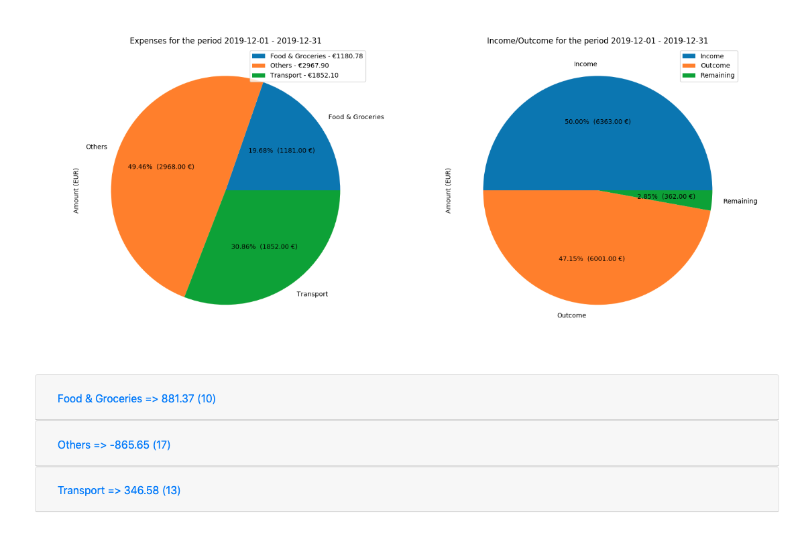

# Expenses digest

## How?

By adding a *mappings.txt* like:

```
# the script will map expenses looking for the closest match
Food & Groceries=[rewe,food,macdonalds,bar, restaurant]
Tranfers=[Transferwise]
Gym=[Dokan,Fitx]
Pharmacy=[DM,APOTHEKE,Healthcare]
Transport=[bahn,bvg,flixbus,Transport]
Internet & Cellular=[vodafone]
```

Run the main script:

```bash
~/path/to/project/$ python3 digest.py [csv file]
```

Access index.html for a list of digested expenses.
The generated digest should have a period overview:



With more detailed expenses divided by type:


## Debug

The CSV file must have this columns:

```csv
"Date","Payee","Account number","Transaction type","Payment reference","Category","Amount (EUR)","Amount (Foreign Currency)","Type Foreign Currency","Exchange Rate"
```

## Meta

Alex Rocha - [about.me](http://about.me/alex.rochas) -